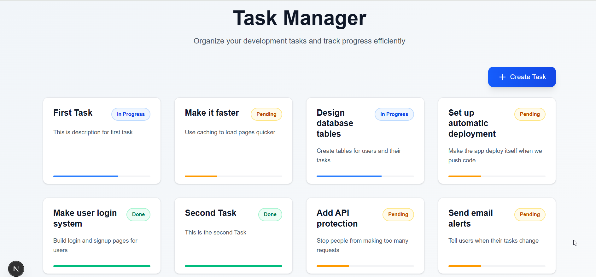
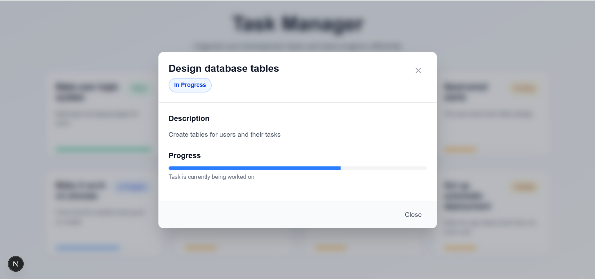
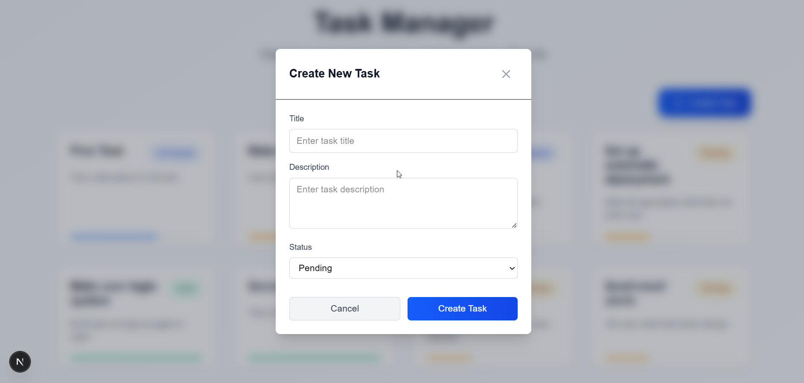
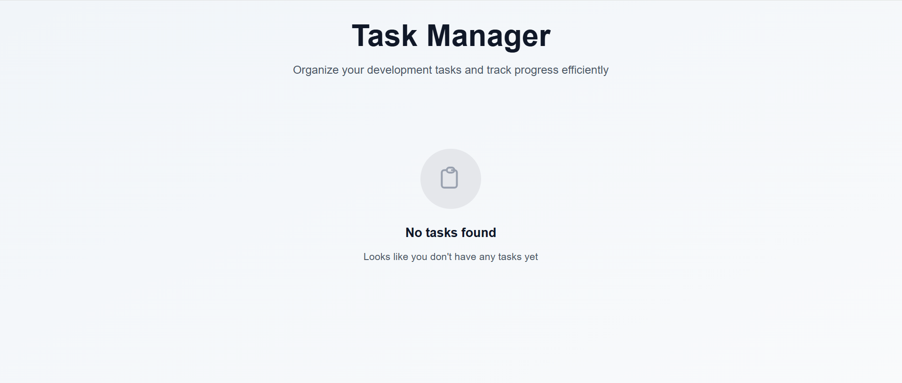
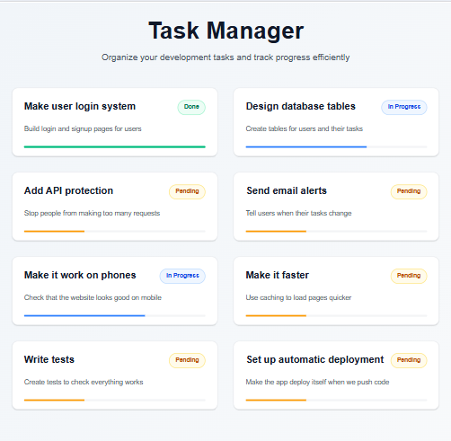
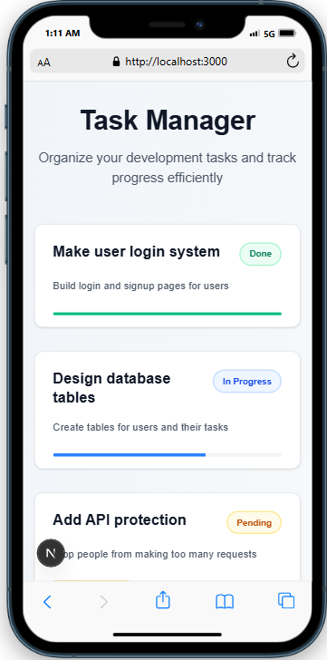
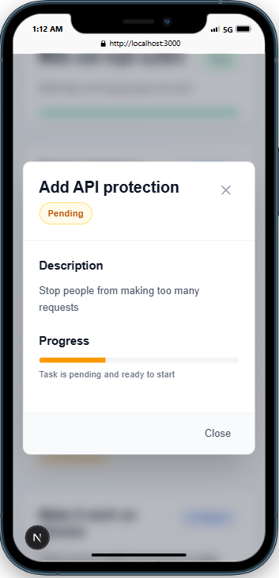
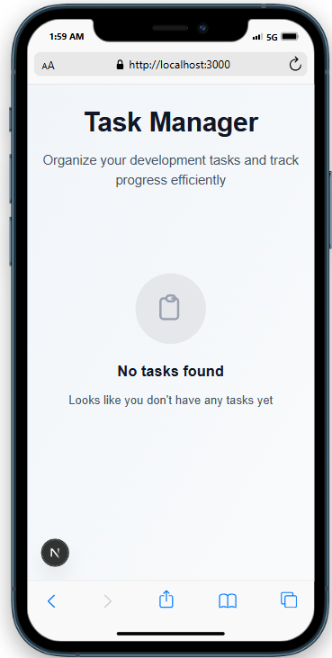

# Task Manager
## RethinkDB Database API
A simple task management app with RethinkDB database. Shows tasks with different statuses and opens modal when you click on cards. Now supports creating new tasks by API.

## Desktop View


### Popup Modal

### Create Task

### No Tasks


## iPad View


## Mobile View


### Mobile Popup Modal

### Mobile No Tasks


## Switch to Correct Branch

Make sure you're on the `db-backed-tasks-api` branch:

```bash
git checkout -b db-backed-tasks-api origin/db-backed-tasks-api
```

## How to Install

### Backend (Laravel and RethinkDB)

1. Choose how to run RethinkDB

**A: Docker (Easy)**
```bash
docker run -d -P --name rethink1 rethinkdb
```
This downloads and starts RethinkDB in a container. Check the port it uses:
```bash
docker port rethink1
```

**B: Install directly on your machine**
- **Windows**: Download from https://rethinkdb.com/docs/install/windows/
- **Mac**: `brew install rethinkdb`
- **Linux**: `sudo apt-get install rethinkdb` or download from website

2. Start RethinkDB server

**If using Docker (A):**
RethinkDB is already running

**If installed directly (B):**
```bash
rethinkdb
```
This starts server on port 28015

3. Go to backend folder:
```bash
cd backend
```

4. Install PHP dependencies:
```bash
composer install
```

5. Copy environment file:
```bash
cp .env.example .env
```

6. Add RethinkDB settings to .env file
Add these lines to your .env file:

**If using Docker (A):**
```env
RETHINKDB_HOST=localhost
RETHINKDB_PORT=32768
RETHINKDB_DATABASE=taskmanager
RETHINKDB_USERNAME=
RETHINKDB_PASSWORD=
```

**If installed directly (B):**
```env
RETHINKDB_HOST=localhost
RETHINKDB_PORT=28015
RETHINKDB_DATABASE=taskmanager
RETHINKDB_USERNAME=
RETHINKDB_PASSWORD=
```

7. Generate app key:
```bash
php artisan key:generate
```

#### Step 8: Seed initial tasks
```bash
php artisan rethinkdb:seed
```

#### Step 9: Start server
```bash
php artisan serve
```

**Note**: If you get port error, change RETHINKDB_PORT in .env to different port like 28016

#### Troubleshooting:
- **Check if container is running**: `docker ps`
- **Check the port mapping**: `docker port rethink1`
- **Restart container**: `docker restart rethink1`
- **View container logs**: `docker logs rethink1`
- **Access RethinkDB admin**: Open `http://localhost:32768` in your browser

### Frontend (Next.js)
1. Go to frontend folder:
```bash
cd frontend
```

2. Create environment file:
```bash
echo 'NEXT_PUBLIC_API_URL="http://127.0.0.1:8000"' > .env.development.local
```

3. Install Node.js dependencies:
```bash
npm install
```

4. Start development server:
```bash
npm run dev
```

## What This App Does
- Shows list of tasks in grid layout
- Each task has title, description, and status
- Click on task card to see full details in modal
- Responsive design works on desktop, tablet, and phone
- Uses Tailwind CSS for styling
- Has translations support
- Shows empty state when no tasks exist
- RethinkDB database backend

## Why I Chose Custom Artisan Command

I chose to use a custom Artisan command (`php artisan rethinkdb:seed`)

The custom command approach is good because the data is not mixed with the main API logic. Anyone can run `php artisan rethinkdb:seed` to quickly get sample tasks, and the system automatically creates the database and table if they don't exist.

When we run the seed command, it only adds the hardcoded sample tasks. If we later add new tasks through the app using the "Create Task" button, those new tasks will be saved in the database alongside the seeded ones.

I also created `php artisan rethinkdb:clear` command that drops and recreates the table. This is useful for development because we can quickly reset to a clean state and then reseed with sample data.

This approach still has the data hardcoded in the command file. When you want to change the sample data, you still need to edit the command code. This is not as flexible as true database seeding where data comes from external sources. But for a small project like this, it's a reasonable that keeps the main code clean while providing easy setup.

## Project Structure

```
Palm2/
├── backend/          # Laravel API
├── frontend/         # Next.js app
└── README.md
```

## Technologies Used

- **Backend**: Laravel, PHP, RethinkDB
- **Frontend**: Next.js, React, TypeScript, Tailwind CSS
