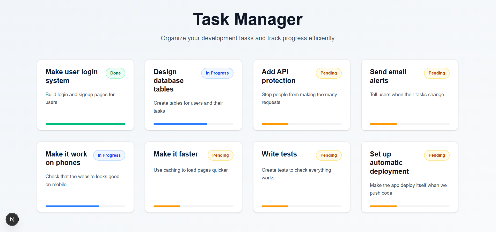

# Task Manager
## Hardcoded Tasks API
A simple task management app with hardcoded data. Shows tasks with different statuses and opens modal when you click on cards.

## Desktop View


### Popup Modal

### No Tasks


## iPad View


## Mobile View


### Mobile Popup Modal

### Mobile No Tasks


## How to Install

### Backend (Laravel)

1. Go to backend folder:
```bash
cd backend
```

2. Install PHP dependencies:
```bash
composer install
```

3. Copy environment file:
```bash
cp .env.example .env
```

4. Generate app key:
```bash
php artisan key:generate
```

5. Start server:
```bash
php artisan serve
```

### Frontend (Next.js)
1. Go to frontend folder:
```bash
cd frontend
```

2. Create environment file:
```bash
echo 'NEXT_PUBLIC_API_URL="http://127.0.0.1:8000"' > .env.development.local
```

3. Install Node.js dependencies:
```bash
npm install
```

4. Start development server:
```bash
npm run dev
```

## What This App Does
- Shows list of tasks in grid layout
- Each task has title, description, and status
- Click on task card to see full details in modal
- Responsive design works on desktop, tablet, and phone
- Uses Tailwind CSS for styling
- Has translations support
- Shows empty state when no tasks exist

## Project Structure

```
Palm2/
├── backend/          # Laravel API
├── frontend/         # Next.js app
└── README.md
```

## Technologies Used

- **Backend**: Laravel, PHP
- **Frontend**: Next.js, React, TypeScript, Tailwind CSS
